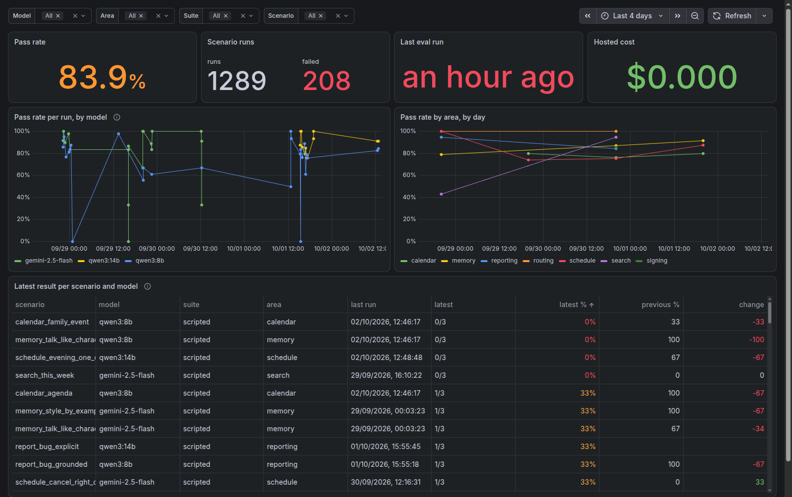

# Uriel

A family assistant that runs on a home server. Family members log in with single sign-on and chat with
an agent that can search the household's documents, fill in and sign forms, run scheduled jobs and check on the
homelab. The tool server checks the caller's groups before every call. The models run locally on Ollama, so
conversations and documents stay in the house.

This repo holds the gateway and the agent. The tools live in a separate MCP server,
[uriel-tools](https://github.com/TonyHeadband/uriel-tools), with its own releases.

## Architecture

```
 browser ──OIDC──► Authelia
    │ session cookie
    ▼
┌──────────── uriel-gateway (FastAPI) ─────────────┐
│ auth/     OIDC code+PKCE → session; Bearer JWT   │
│           or X-API-Key → Principal(user, groups) │
│ web/      htmx page: GET / , POST /chat (SSE)    │
│ api/      POST /v1/chat  (JSON, for agents)      │
│           POST /v1/chat/stream (SSE, desktop app)│
│ agent/    LangGraph graph, no FastAPI imports    │
│   route ─► Decider ─► respond | agent⇄tools      │
└───────┬───────────────────────┬──────────────────┘
        │ X-API-Key + {user,groups}        │ checkpoints, memory
        ▼                                  ▼
  uriel-tools (FastMCP)             Postgres + pgvector
  gate(tool, groups) → run | refuse
        │
  Ollama (qwen3:8b on an 8 GB GPU)
```

- **Identity:** humans sign in through Authelia OIDC, and the gateway validates the tokens itself. Services and
  other agents use API keys mapped to fixed principals. Network location is never used for authorization.
- **Agent:** a LangGraph loop with a Postgres checkpointer, so each user's history survives restarts and stays theirs.
  A `Decider` routes each turn between a direct reply and the tool loop.
- **Tools:** the gateway forwards the caller's user and groups to the MCP server, which refuses any tool the caller
  isn't allowed to use. The agent never offers a `family` user an `admins` tool.
- **Models:** config-driven roles (`interactive`, `background`, `embedding`, `ocr`) in one
  [models file](config/models.yaml) shared by every process, so moving to bigger hardware is a config change.
- **Deployment:** CI builds the Docker images on a tag push, and Argo CD deploys them to a single-node k3s cluster.

## Evals

`evals/` measures how well the agent picks tools and fills their arguments. It runs the real graph, prompt and router
against a real model, and answers every tool call from scripted results, so nothing gets filed, edited or signed.
Design changes are judged on qwen3:14b, the target tier, and compared with qwen3:8b, the smallest model it has
to work on; a hosted model is an occasional ceiling check. The full suite runs on the local model before each
release.
See [docs/development.md](docs/development.md#tool-use-evals-real-model-scripted-tools).

Every eval run and pytest session is published to a results database. Grafana shows pass rates per model,
area and scenario over time:



## Design docs

- [Milestone 1: the agent harness](docs/specs/2026-09-27-milestone-1-design.md): identity, trust boundaries,
  the decisions and the alternatives rejected.
- [Decision layer](docs/specs/2026-09-29-decision-layer-design.md): a small second model to narrow tool choice,
  and the measurements that kept it switched off.

## Run it

Needs [uv](https://docs.astral.sh/uv/) and Docker.

```bash
uv sync
uv run pytest                     # unit and graph tests
```

End to end with a stub model, no GPU needed:

```bash
URIEL_MODELS_FILE=/e2e/models.e2e.yaml docker compose -f deploy/compose.yaml --profile e2e up -d --build --wait
URIEL_E2E_URL=http://localhost:8000 uv run pytest -m e2e
docker compose -f deploy/compose.yaml --profile e2e down -v
```

More in [docs/development.md](docs/development.md).

## Stack

Python 3.13, FastAPI, LangGraph, FastMCP, Postgres with pgvector, Ollama, htmx, Docker, k3s, Argo CD.

## License

[MIT](LICENSE)
